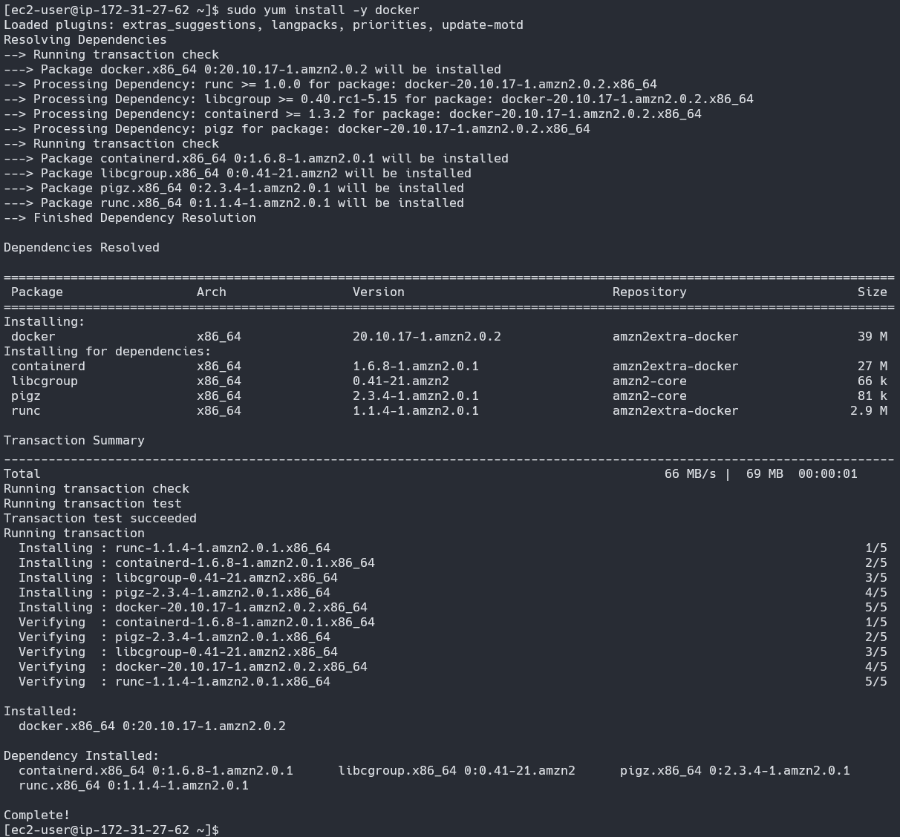

# How To Setup Jenkins via Docker and Connect it to GitHub by Creating a Pipeline (AWS EC2)
If you are learning Jenkins just like me, you will find that it is preferable if the Jenkins is running on a server that can be accessed by other applications if need be.
We will achieve exactly that by deploying Jenkins inside an AWS EC2 instance but inside a docker container, the reason I use docker is that it is an optimal way of keeping the environment isolated but also because I am learning docker at the same time.

## Step 1: Connect to your instance via SSH using generated key.

---

## Step 2: Install Docker.
```bash
> sudo yum install -y docker
```

---

## Step 3: Start Docker services and check its status.
```bash
> sudo service docker start
> sudo service docker status
```

---

## Step 4: Grant Docker sudo privilages so it won't ask everytime you call it.
```bash
> sudo usermod -a -G docker ec2-user
```


#### Note: Remember to re-login to your instance after executing command.
---

## Step 5: Run Jenkins via Docker.
```bash
> docker run -d --name jenkins -p 8080:8080 -p 50000:50000 -v /var/jenkins_home jenkins/jenkins:lts
```

---

## Step 6: Check if Jenkins is up by accessing the public IPv4 address of your instance.
```bash
> "ipv4-public-ip":8080
```

---

## Step 7: As we can see from step 6, Jenkins is locked. We can capture its key by accessing the Docker logs of Jenkins.
```bash
> docker container ls
> docker logs -f "container-id"
```


---

## Step 8: After unlocking Jenkins, we are greeted with two opetions: Install suggested plugins and Select plugins to install. For our case, we will choose Install suggested plugins. 


---

## Step 9: After installing suggested plugins, you are given a choice to Create First Admin user or to Skip and continue as admin. It is recommended that you Create First Admin User.

---

## Step 10: After Creating First Admin User, you are given the Jenkins URL of your Instance Configuration. It is advisable that you save it.

---

## Step 11: Jenkins is now ready to use!


---

## Now, let us create a Pipeline and connect it GitHub.

## Step 12: From your Dashboard, select New Item and create a new Pipeline.

---

## Step 13: Now go to the pipeline session, paste the code below, and click on the Save button.
```bash
pipeline {
    agent any
    stages {
        stage('Build') {
            steps {
                // Get some code from a GitHub repository
                git url: 'https://github.com/naiveskill/devops.git', branch: 'main'
                // Change file permisson
                sh "chmod +x -R ./jenkins"
                // Run shell script
                sh "./jenkins/script/scripted_pipeline_ex_2.sh"
            }
        }
    }
}
```

---

## Step 14: After saving, select Build Now and wait for it to finish building.


---

## Step 15: Now, let us try Jenkins pipeline github with credentials.

```bash
pipeline {
    agent any
    stages {
        stage('Build') {
            steps {
                // Get code from a GitHub repository
                git url: 'https://github.com/9QIX/jenkins-to-github-credentials', branch: 'main',
                 credentialsId: 'github_creds'
            }
        }
    }
}
```

---

## Step 16: To create a github token, log in to the github account and go to setting. Now click on the developer setting.

---

## Step 17: Now click on personal access tokens > Generate new token. Provide necessary as per your need and click on Generate token. A token will be generated, which you can use for authenticating the github.


---

## Step 18: Now go to Jenkins URL and goto Manage Jenkins > Manage Credentials > System > Global credentials (unrestricted) > Add Credentials


---

## Step 19: Provide username and github secrets in place of password and then click on the CREATE button.


---

## Step 20: Go back to your Jenkins Pipeline with credentials and build it.


---

## Step 21: As you can see in your dashboard, both of your items are in good status.

---
