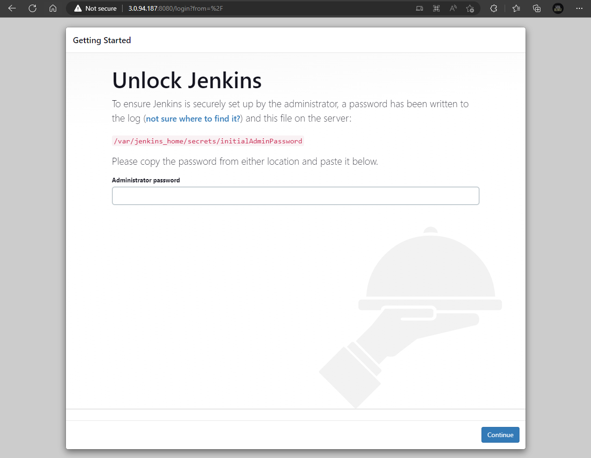
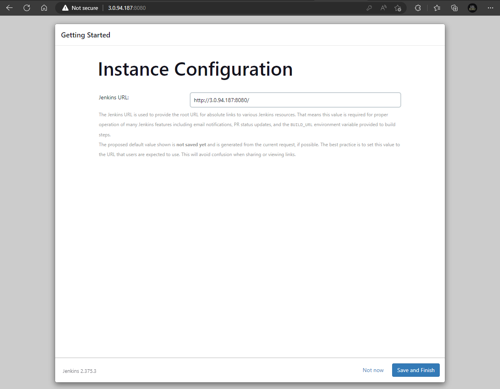

# Configuring Jenkins with Docker and GitHub Integration via AWS EC2 for Pipeline Creation


If you are new to Jenkins, you may find it beneficial to run Jenkins on a server accessible to other applications. We will deploy Jenkins inside an AWS EC2 instance, encapsulated in a Docker container. Using Docker is ideal as it provides an isolated environment, and it aligns with learning Docker alongside Jenkins.

## Step 1: Connect to Your EC2 Instance via SSH


---

## Step 2: Install Docker

```bash
> sudo yum install -y docker
```


---

## Step 3: Start Docker Services and Check Status

```bash
> sudo service docker start
> sudo service docker status
```


---

## Step 4: Grant Docker Sudo Privileges

```bash
> sudo usermod -a -G docker ec2-user
```


**Note:** Remember to re-login to your instance after executing the command.

---

## Step 5: Run Jenkins via Docker

```bash
> docker run -d --name jenkins -p 8080:8080 -p 50000:50000 -v /var/jenkins_home jenkins/jenkins:lts
```


---

## Step 6: Check Jenkins Status

Access Jenkins by using your instance's public IPv4 address and port 8080.



---

## Step 7: Unlock Jenkins

Jenkins is locked initially. Retrieve the unlock key from the Docker logs of the Jenkins container.

```bash
> docker container ls
> docker logs -f "container-id"
```


---

## Step 8: Install Suggested Plugins

After unlocking Jenkins, choose to install the suggested plugins.


---

## Step 9: Create First Admin User

Create the first admin user.


---

## Step 10: Save Jenkins URL

After creating the admin user, save the Jenkins URL provided for instance configuration.



---

## Step 11: Jenkins is Ready to Use

Jenkins is now ready for use.


---

## Create a Pipeline and Connect to GitHub

## Step 12: Create a New Pipeline

From your Jenkins dashboard, select "New Item" to create a new pipeline.


---

## Step 13: Define Pipeline Script

In the pipeline section, paste the provided script and click "Save."

```bash
pipeline {
    agent any

    stages {
        stage('Clone Repo') {
            steps {
                echo '[INFO] Cloning Repository'
                sh 'git clone --depth 1 --single-branch https://github.com/WonderCMS/wondercms.git'
                sh 'ls wondercms'
            }
        }
        stage('Provision AWS Instance') {
            steps {
                echo '[INFO] Deploying to AWS'
                // sh 'scp -r web_app user@ip_add:/var/www/html'
            }
        }
        stage('Deploy') {
            steps {
                echo '[INFO] Sending Notifications'
                // sh 'sh notif.sh'
            }
        }
        stage('Notification') {
            steps {
                echo '[INFO] Sending Notifications'
                slackSend channel: '#random', message: 'test', teamDomain: 'randomresearchinc.slack.com', tokenCredentialId: 'slack'
                cleanWs()
            }
        }
    }
}
```


---

## Step 14: Build the Pipeline

After saving the pipeline, select "Build Now" and wait for it to finish building.


---

## Jenkins Pipeline with GitHub Credentials

## Step 15: Define Pipeline Script with GitHub Credentials

Use this script to build your pipeline using GitHub credentials:

```bash
pipeline {
    agent any
    stages {
        stage('Build') {
            steps {
                // Get code from a GitHub repository
                git url: 'https://github.com/9QIX/jenkins-to-github-credentials', branch: 'main',
                 credentialsId: 'github_creds'
            }
        }
    }
}
```


---

## Step 16: Create a GitHub Token

To create a GitHub token, log in to your GitHub account, go to settings, and click on "Developer settings."


---

## Step 17: Generate a Personal Access Token

Navigate to "Personal access tokens," click "Generate new token," provide necessary permissions, and click "Generate token" to obtain the token for GitHub authentication.


---

## Step 18: Add GitHub Credentials in Jenkins

In Jenkins, go to "Manage Jenkins" > "Manage Credentials" > "System" > "Global credentials (unrestricted)" > "Add Credentials."


---

## Step 19: Provide Credentials

Provide your GitHub username and the generated GitHub token in place of the password, then click "CREATE."


---

## Step 20: Build the Pipeline with GitHub Credentials

Return to your Jenkins Pipeline with GitHub credentials and build it.


---

## Step 21: Verify Pipeline Status

Check the status of both items on your Jenkins dashboard.


